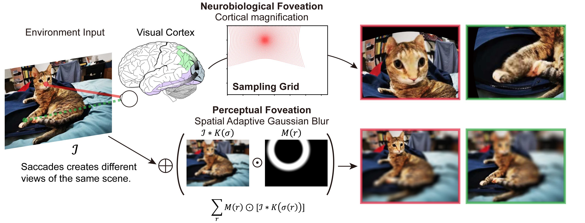

# Self-Supervised Learning (SimCLR) with Biological Plausible Image Augmentations

Official code base for the poster "On the use of Cortical Magnification and Saccades as Biological Proxies for Data Augmentation" published in NeurIPS 2021 Workshop [Shared Visual Representations in Human and Machine Intelligence (SVRHM)](https://www.svrhm.com/). [OpenReviews](https://openreview.net/forum?id=Rpazl253IHb)

Is it possible that human learn their visual representations with a self-supervised learning framework similar to the machines? Popular self-supervised learning framework encourages the model to learn similar representations invariant to the augmentations of the images. Is it possible to learn good visual representation using the natural "image augmentations" available to our human visual system? 

In this project, we reverse-engineered the key data augmentations that support the learned representation quality , namely random resized crop and blur. We hypothesized that saccade and foveation in our visual processes, is the equivalence of random crops and blur. We implement these biological plausible transformation of images and test if they could confer the same representation quality as those engineered ones. 

Our experimental pipeline is based on the pytorch SimCLR implemented by [sthalles](https://github.com/sthalles/SimCLR) and by [Spijkervet](https://github.com/Spijkervet/SimCLR). Our development supports our biologically inspired data augmentations, visualization and *post hoc* data analysis. 

## Usage

### Colab Tutorials
* [](https://colab.research.google.com/drive/1NhZ2Kkw3spR8ki9f8ETFbX2pk-032YLV?usp=sharing) 
 Tutorial: Demo of Biological transformations 
* [](https://colab.research.google.com/drive/1F_qjhx0OdDzfAkuWi178E5De_fEP7OC6?usp=sharing)
 Tutorial: Demo of Training STL10 
* [](https://colab.research.google.com/drive/18V0f81Sm8H4uruP1SGhiV3eiHF1Io1k7?usp=sharing)
 Tutorial: Sample training and evaluation curves.

### Local Testing
For running a quick demo of training, replace the `$Datasets_path` with the parent folder of `stl10_binary` (e.g. `.\Datasets`). You could download and extract STL10 from [here](https://cs.stanford.edu/~acoates/stl10/). Replace `$logdir` with the folder to save all running logs and checkpoints, then you can use `tensorboard --logdir $logdir` to view the training process.
```bash
python run_magnif.py -data $Datasets_path -dataset-name stl10 --workers 16 --log_root $logdir\
	--ckpt_every_n_epocs 5 --epochs 100  --batch-size 256  --out_dim 256  \
	--run_label proj256_eval_magnif_cvr_0_05-0_35 --magnif \
	--cover_ratio 0.05 0.35  --fov_size 20  --K  20  --sampling_bdr 16 
```
Code has been tested on Ubuntu and Windows10 system. 

### Cluster Testing
For running in docker / on cluster, we used the following pytorch docker image `pytorchlightning/pytorch_lightning:base-cuda-py3.9-torch1.9`. For settings for LSF Spectrum cluster, you can refer to `scripts`. These jobs are submitted via `bsub < $name_of_script`

To support multi-worker data-preprocessing, `export LSF_DOCKER_SHM_SIZE=16g` need to be set beforehand. Here is the example script for setting up an interactive environment to test out the code. 
```bash
export LSF_DOCKER_SHM_SIZE=16g 
bsub -Is -M 32GB -q general-interactive -R 'gpuhost' -R  'rusage[mem=32GB]'  -gpu "num=1:gmodel=TeslaV100_SXM2_32GB" -a 'docker(pytorchlightning/pytorch_lightning:base-cuda-py3.9-torch1.9)' /bin/bash
```

Multi-GPU training has not been tested.


## Implementation
We implemented foveation in two ways: one approximating our perception, the other approximating the cortical representation of the image. In our perception, we can see with highest resolution at the fixation point, while the peripheral vision is blurred and less details could be recognized (Arturo; Simoncelli 2011). Moreover, when we change fixation across the image, the [whole scene still feels stable](https://www.sciencedirect.com/science/article/pii/S0042698908001727) without shifting. So we model this perception as a spatially varying blur of image as people classically did. 

In contrast, from a neurobiological view, our visual cortex distorted the retinal input: a larger cortical area processes the input at fovea than that for periphery given the same image size. This is known as the [cortical magnification](https://en.wikipedia.org/wiki/Cortical_magnification). Pictorially, this is magnifying and over-representing the image around the fixation points. We model this transform with sampling the original image with a warpped grid.



These two different views of foveation (perceptual vs neurobiological) were implemented and compared as data augmentations in SimCLR. 


## Structure of Repo
* Main command line interface
	* `run.py` Running baseline training pipeline without bio-inspired augmentations. 
	* `run_salcrop.py` Running training pipeline with options for foveation transforms and saliency based sampling. 
	* `run_magnif.py` Running training pipeline with options for foveation transforms and saliency based sampling. 
* `data_aug\`, implementation of our bio-inspired augmentations
* `posthoc\`, analysis code for training result. 
* `scripts\`, scripts that run experiments on cluster. 


## Dependency
* pytorch. Tested with version 1.7.1-1.10.0
* [kornia](https://kornia.readthedocs.io/en/latest/get-started/installation.html) `pip install kornia`. Tested with version 0.3.1-0.6.1. 
* [FastSal](https://github.com/Animadversio/FastSal), we forked and modified a few lines of [original](https://github.com/feiyanhu/FastSal) to make it compatible with current pytorch 3.9 and torchvision. 


Inquiries: binxu_wang@hms.harvard.edu