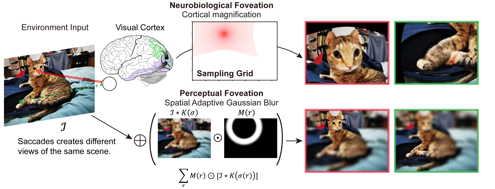

## Are Human Visual Systems Implementing Augmentations for Self-Supervised Learning?

"On the use of Cortical Magnification and Saccades as Biological Proxies for Data Augmentation" Official code base [OpenReviews](https://openreview.net/forum?id=Rpazl253IHb)

Authors: Binxu Wang, David Mayo, Arturo Deza, Andrei Barbu, Colin Conwell

This project is published in NeurIPS 2021 Workshop [Shared Visual Representations in Human and Machine Intelligence (SVRHM)](https://www.svrhm.com/). 

## Background
Is it possible that human learn their visual representations with a self-supervised learning framework similar to the machines? Popular self-supervised learning framework encourages the model to learn similar representations invariant to the augmentations of the images. Is it possible to learn good visual representation using the natural "image augmentations" available to our human visual system? 

In this project, we reverse-engineered the key data augmentations that support the learned representation quality: random resized crop and blur. We hypothesized that saccade and foveation in our visual processes, are the biological counterpart of random crops and blur. We implement these biological plausible transformations of image and test if they could confer the same representation quality as those engineered ones. 

## Implementation
We implemented foveation in two ways: one approximating our perception, the other approximating the cortical representation of the image. In our perception, we can see with highest resolution at the fixation point, while the peripheral vision is blurred and less details could be recognized (Arturo; Simoncelli 2011). Moreover, when we change fixation across the image, the [whole scene still feels stable](https://www.sciencedirect.com/science/article/pii/S0042698908001727) without shifting. So we model this perception as a spatially varying blur of image as people classically did. 

In contrast, from a neurobiological view, our visual cortex distorted the retinal input: a larger cortical area processes the input at fovea than that for periphery given the same image size. This is known as the [cortical magnification](https://en.wikipedia.org/wiki/Cortical_magnification). Pictorially, this is magnifying and over-representing the image around the fixation points. We model this transform with sampling the original image with a warpped grid.

These two different views of foveation (perceptual vs neurobiological) were implemented and compared as data augmentations in SimCLR. 

## Usage

## Results

## See Also
Our experimental pipeline is heavily based on the pytorch SimCLR implemented by [sthalles](https://github.com/sthalles/SimCLR) and by [Spijkervet](https://github.com/Spijkervet/SimCLR).
